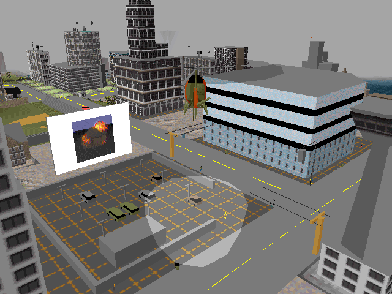
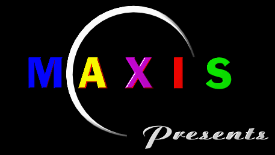
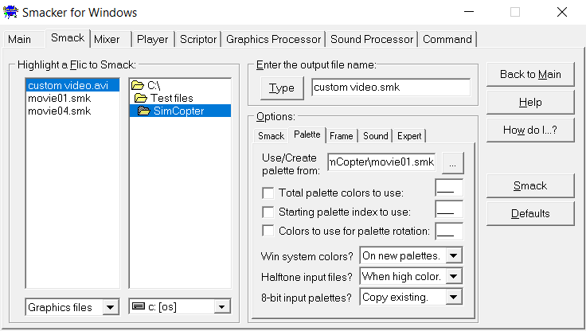
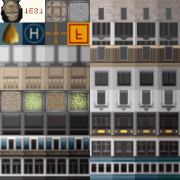
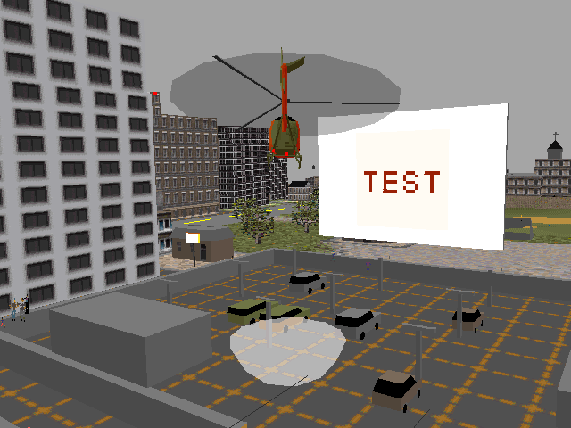
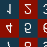
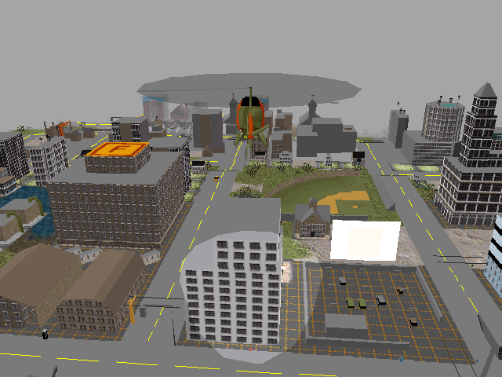
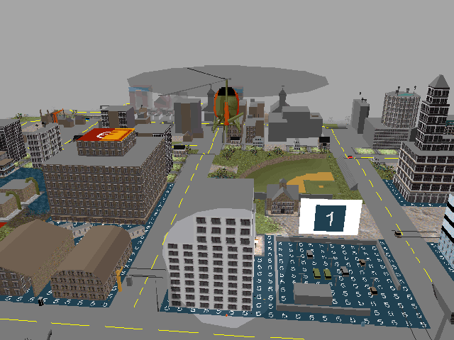
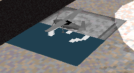
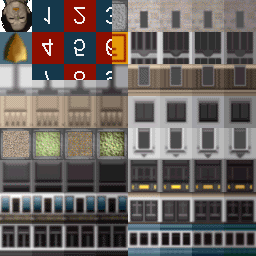

# Making Videos for SimCopter's Drive-In Movie Theatres

This document explains (in what some might reasonably consider excessive detail) how to create custom videos for the drive-in movie theatres that appear in the 1996 video game [SimCopter](https://en.wikipedia.org/wiki/SimCopter).

It may also be of interest to people who wish to create videos for other old games that, like SimCopter, use version 2 of the Smacker video format ("SMK2").

* [1 Background](#1-background)
* [2 Tools and Technical Information](#2-tools-and-technical-information)
* [3 How to Create a Smacker Video for SimCopter's Drive-In Movie Theatres](#3-how-to-create-a-smacker-video-for-simcopters-drive-in-movie-theatres)
  * [3.1 Set Up Smacker Tools (One-Time Task)](#31-set-up-smacker-tools-one-time-task)
  * [3.2 Create the Source Video](#32-create-the-source-video)
  * [3.3 Organize Files (Optional)](#33-organize-files-optional)
  * [3.4 Convert the Source Video to Smacker Format](#34-convert-the-source-video-to-smacker-format)
  * [3.5 View Your Custom Video in SimCopter](#35-view-your-custom-video-in-simcopter)
* [4 What Happens If a Video Doesn't Use the Game's Palette?](#4-what-happens-if-a-video-doesnt-use-the-games-palette)
* [5 What Happens If a Video's Resolution Exceeds 32 x 32 Pixels?](#5-what-happens-if-a-videos-resolution-exceeds-32-x-32-pixels)
* [6 Miscellaneous Information](#6-miscellaneous-information)

## 1 Background

SimCopter includes several video files that can be viewed on the screen of the drive-in movie theatre. The theatre screen is usually blank, but a video will play on it if the "Lights, Camera, Action!" cheat code is entered (to do so, open the cheat code window by pressing Ctrl + Alt + X; the code may need to be entered twice to take effect). Videos will sometimes play without the use of this cheat code; this seems to be more likely if the game chooses night mode when starting a level.

*The drive-in movie theatre in `CAPE WELLS.SC2` (a city included with SimCopter) playing `movie01.smk`, a short video of a small building exploding. There's no accounting for taste, I suppose.*

The videos played by the drive-in theatre are stored in the `smk` directory within SimCopter's main directory and are all named `movie<two-digit number>.smk` (e.g., `movie04.smk`). Additional videos (such as the introductory videos for each of the cities used in the game's career mode) are also present in this directory.

All of SimCopter's video files use the [Smacker video format](https://en.wikipedia.org/wiki/Smacker_video). This format was developed by RAD Game Tools in the 1990s and has been used in many games besides SimCopter, including [Streets of SimCity](https://en.wikipedia.org/wiki/Streets_of_SimCity) and [Interstate '76](https://en.wikipedia.org/wiki/Interstate_%2776). (Incidentally, RAD Game Tools was purchased by Epic Games in early 2021 and renamed Epic Game Tools.)

SimCopter's README mentions that custom videos can be created for the drive-in movie theatre:

> Movies can be played on the drive-in movie theatre?
>
> Like the SimRadio system described in the manual, you can also add your own movies to the drive-in movie theatres. Videos greater than 32K will only run on a computer with at least 24MB of RAM installed, However, you would need to be able to create small 32x32 pixel Smacker™ 
movies in the same palette that the game uses. Smacker is an 8-bit movie compression-decompression system made by RAD Game Tools™. As of this writing, they were giving away the compressor tools for free. However, their licensing agreement may prohibit unlicensed use of the compressor for making movies to add to games. Check with RAD at http://www.radvantage.com/.

(For reference, here are archived copies of [radvantage.com's landing page](https://web.archive.org/web/19980120113522/http://www.radvantage.com/) and [its Smacker-specific page](https://web.archive.org/web/19980120113606/http://www.radvantage.com/smack.htm) as they appeared in January 1998.)

## 2 Tools and Technical Information

* [VLC Media Player](https://www.videolan.org/) can play Smacker video files (among many other formats). If you simply want to view SimCopter's videos outside the game, using VLC is likely the best option.
* There are at least two versions of the Smacker video codec that saw widespread use: version 2 and version 4.
  * Version 2 files start with a [file signature](https://en.wikipedia.org/wiki/File_signature) of "SMK2" in ASCII (`53 4D 4B 32` in hex), while version 4 files start with "SMK4".
  * The easiest way to determine the version of a Smacker file is to open it with a [hex editor](https://en.wikipedia.org/wiki/Hex_editor) (I recommend [HxD](https://mh-nexus.de/en/hxd/)) and check the ASCII value of the first four bytes.
  * For convenience, "SMK2" and "SMK4" will be used to refer to files encoded using versions 2 and 4 (respectively) of the Smacker codec for the remainder of this document.
* SimCopter can only read SMK2 files. If a SMK4 file has its signature changed to "SMK2", SimCopter will play it, but the video will be corrupted.
* To create SMK2 files, the original set of Smacker tools must be used. The newer RAD Video Tools can only create SMK4 files.
* As of late 2021, the installer for the original Smacker tools is still available from RAD's site at [www.radgametools.com/down/Smacker/SmkTools.exe](http://www.radgametools.com/down/Smacker/SmkTools.exe), although this may change in the future. It's also available via the Internet Archive's Wayback Machine [here](https://web.archive.org/web/20211224235218/http://www.radgametools.com/down/Smacker/SmkTools.exe).
  * As noted above, the newer RAD Video Tools cannot be used to create SMK2 files; however, for reference, the installer for them is available via the Wayback Machine [here](https://web.archive.org/web/20190518072552/http://www.radgametools.com/down/Bink/RADTools.exe) (it's no longer available from RAD's site).
* [WineVDM](https://github.com/otya128/winevdm) is a [Virtual DOS Machine](https://en.wikipedia.org/wiki/Virtual_DOS_machine) based on [Wine](https://en.wikipedia.org/wiki/Wine_(software)); see [this description](https://emulation.gametechwiki.com/index.php/WineVDM) for additional details. It allows 16-bit applications to run on 64-bit versions of Windows. (The installer for the original Smacker tools is a 16-bit application.)
* Ideally, videos created for SimCopter's drive-in theatre should:
  * Use the game's palette. It can be obtained from any of the existing drive-in movies as described later in this document.
  * Have a resolution of 32 x 32 pixels.
  * Have a frame rate of 10 frames per second (this is the frame rate of the included drive-in movies).
    * The frame rate of a Smacker file can be checked using the original Smacker tools (by enabling "Show a playback summary" in the "Player" tab, then playing the video) or the newer RAD Video Tools (using the "File info" button).

## 3 How to Create a Smacker Video for SimCopter's Drive-In Movie Theatres

These instructions were tested on a computer running Windows 10. [SimCopterX](http://alekasm.com/scx.html) was used to run SimCopter.

### 3.1 Set Up Smacker Tools (One-Time Task)

1. Download the Smacker tools installer (`SmkTools.exe`) from RAD's site [here](http://www.radgametools.com/down/Smacker/SmkTools.exe) or from the Wayback Machine [here](https://web.archive.org/web/20211224235218/http://www.radgametools.com/down/Smacker/SmkTools.exe).
2. `SmkTools.exe` is a 16-bit executable and won't run on modern versions of Windows as-is. To overcome this problem, download and install [WineVDM](https://github.com/otya128/winevdm):
    1. Download the latest stable release of WineVDM from [here](https://github.com/otya128/winevdm/releases).
    2. Follow the installation instructions [here](https://github.com/otya128/winevdm/blob/master/README.md).
3. Open the folder containing `SmkTools.exe` and ensure no files are selected.
4. Hold shift and right-click in the folder. Select "Open PowerShell window here" from the context menu.
5. Copy the following command and paste it into the PowerShell window: `.\SmkTools.exe /x Smacker-Tools`
    * If `SmkTools.exe` is run directly (e.g., by double-clicking on it), it will run, but installation will fail with an "unable to open unwise.exe" error.
    * `SmkTools.exe` is a [Wise installer](https://en.wikipedia.org/wiki/Wise_Solutions), so running it with the `/x` command-line parameter tells it to extract its contents to the specified folder (in this case, `Smacker-Tools`). See [this page](https://www.tek-tips.com/viewthread.cfm?qid=908751) for details.
6. (Optional: change DPI scaling settings to prevent the Smacker interface from being blurry.) Open the `Smacker-Tools` folder, right-click on `smackerw.exe`, and select "Properties". On the "Compatibility" tab, press the "Change high DPI settings" button. In the "High DPI scaling override" section, enable "Override high DPI scaling behavior" and select "Application" from the "Scaling performed by" drop-down menu. Save the changes.

### 3.2 Create the Source Video

Create an uncompressed [AVI](https://en.wikipedia.org/wiki/Audio_Video_Interleave) video. It should:

* Have a resolution of 32 x 32 pixels
* Have a frame rate of 10 frames per second
* Be flipped vertically

Regarding videos being flipped vertically, the drive-in video file `movie16.smk` (which is an animation of the Maxis logo) included with SimCopter demonstrates that the drive-in videos are flipped vertically, not rotated 180 degrees: the blue "M" of "MAXIS" is still on the left, the gap in the crescent is still on the right, etc.

*The Maxis logo as it appears in SimCopter's introductory cutscene.*

*The Maxis logo as it appears in `movie16.smk`.*

SimCopter's textures are also flipped vertically (at least relative to its sprites; this can be seen by opening `sim3d.bmp` with [my Maxis Texture Tool](https://github.com/CahootsMalone/maxis-texture-tool)), which hints at how SimCopter stores the drive-in videos when loading them into memory. This connection is discussed in section 5 of this document, ["What Happens If a Video's Resolution Exceeds 32 x 32 Pixels?"](#5-what-happens-if-a-videos-resolution-exceeds-32-x-32-pixels).

### 3.3 Organize Files (Optional)

As mentioned earlier, Smacker files for SimCopter's drive-in theatre should use the game's colour palette. Conveniently, the Smacker tools can extract a palette from an existing Smacker file.

For convenience, I recommend copying one of SimCopter's original drive-in video files (i.e., one of the `movie<two-digit number>.smk` files in the `smk` directory) into the same directory as the video you'll be converting to Smacker format. This is optional but makes it easier to find during the conversion process described in the next section.

### 3.4 Convert the Source Video to Smacker Format

1. Navigate to the `Smacker-Tools` folder created earlier when extracting the contents of the Smacker installer.
2. Run `smackerw.exe`. A screenshot of its interface is included below for reference.
3. Select the "Smack" tab.
4. In the "Highlight a Flic to Smack" panel, navigate to the directory containing your source video and select it. (You may need to change the file type filter to "Graphics files" if it's set to something more specific.)
5. (Optional) In the "Enter the output file name" panel, change the output file name.
6. In the "Options" panel, select the "Palette" tab. Press the ellipsis ("...") button and select one of the original drive-in videos included with SimCopter.
7. Press the "Smack" button.

You should now have a Smacker version of your source video.

*The Smacker interface.*

A note regarding the colour palette: the Smacker help file (`smacker.hlp`) says that Smacker can obtain a colour palette from a 256-colour image (although not explicitly stated, presumably the file must use [indexed colour](https://en.wikipedia.org/wiki/Indexed_color)). Although such an image could be produced by extracting the game's palette from one of its `max` files (which [my Maxis Texture Tool](https://github.com/CahootsMalone/maxis-texture-tool) can do) and using it to create an appropriate indexed-colour image, using the palette of one of the included drive-in movies is certainly easier.

### 3.5 View Your Custom Video in SimCopter

1. Copy the Smacker version of your custom video into SimCopter's `smk` directory.
2. Rename one of the included drive-in videos (e.g., by adding a prefix).
3. Rename your custom video so it has the original name of the included video you just renamed.
    * To guarantee that your video will be played, you may wish to repeat steps 2 and 3 for all of the included drive-in videos.
4. Run SimCopter, find a drive-in theatre, press Ctrl + Alt + X, and enter the "Lights, Camera, Action!" cheat code (without the quotation marks).
    * You may need to enter the code twice. If the cheat deactivation sound plays the first time you enter the code, it must be entered a second time.

It's not clear how SimCopter chooses which drive-in movie to play. Although one might expect the movie to be chosen randomly from those available, this doesn't appear to be the case. For example, in my experience the theatre near the hangar in `CAPE WELLS.SC2` (a city included with SimCopter) usually plays `movie01.smk`, although I've seen it repeatedly choose to play `movie04.smk` when running SimCopter on a virtual machine running Windows 98. This behaviour may also vary between different versions of the game.

As noted above, replacing all the existing drive-in videos with your custom video will guarantee that it is shown.

## 4 What Happens If a Video Doesn't Use the Game's Palette?

If a video's colour palette doesn't match that of the game, its colours will be incorrect when it's played on the drive-in theatre screen. SimCopter appears to ignore the colour palette in video files used for the drive-in theatre and always uses the game's palette when looking up colours.

## 5 What Happens If a Video's Resolution Exceeds 32 x 32 Pixels?

The short answer is that the video will overwrite other textures when it's loaded: a 32-by-32 pixel region of it will play on the drive-in screen as per usual, but the parts of it that have overwritten other textures will appear - with animation - on other 3D models (buildings, ground tiles, etc.) as well.

The remainder of this section contains the long answer!

Many of SimCopter's textures are stored in [texture atlases](https://en.wikipedia.org/wiki/Texture_atlas) like the one shown below (extracted from `sky.bmp` using [my Maxis Texture Tool](https://github.com/CahootsMalone/maxis-texture-tool)); each individual texture within the atlas has a size of 32 x 32 pixels.

Note that the "F" texture (which appears on the roof of the fire station) demonstrates that textures are flipped vertically, not rotated 180 degrees, which matches the transformation required for drive-in movies.

(Incidentally, the texture in the upper-left depicting a woman's face appears in various places - including the screen of the drive-in theatre - when the "PAMCAREYGOLDMAN" cheat code is used; according to online sources, she is the wife of SimCopter's lead programmer Ed Goldman.)

The blank texture in the second column of the first row of this texture atlas is used for the screen of the drive-in theatre when it's not playing a movie. This is easily confirmed by modifying the texture in `sky.bmp` (using my aforementioned Maxis Texture Tool) and running SimCopter.

Here's the texture atlas with the word "TEST" (flipped vertically) added to the blank texture:

The modified texture (with "TEST" oriented correctly) appears on the drive-in screen in-game:

To observe the effect of using a drive-in movie with a resolution that exceeds 32 x 32, I've created a video (`checkerboard.smk`, available [here](checkerboard.smk)) with a resolution of 80 x 80 pixels (80 = 2.5 * 32) that alternates between two inversely-coloured red and blue checkerboard patterns. Each square of the checkerboard is 32 x 32 pixels in size and numbered.

Here's a frame from the video:

Following the steps in section 3.5 to view this video in SimCopter yields the following behaviour:

* Square 1 of the checkerboard appears on the drive-in screen, alternating between red and blue.
* The contents of the video spill out beyond the drive-in screen texture and overwrite additional textures.
  * For example, the grey texture with dashed orange lines (used for some ground tiles, like the one under the drive-in theatre) is replaced with square 5 of the checkerboard.
  * Since the video's dimensions (80 x 80) are not integer multiples of 32, some of the textures (like the fire station helipad) are only partially overwritten.
* Overwritten textures are also animated and alternate between red and blue.

A recording of this behaviour is available [here](simcopter-custom-drive-in-movie-demo.mp4).

Before playing the video:

After playing the video (note the partially-overwritten texture on the fire station roof):

Another partially-overwritten texture:

This provides some insight into how SimCopter loads videos played on the drive-in screen: apparently each frame is written directly into the in-memory copy of the texture atlas containing the drive-in screen texture with no bounds checking.

While playing a frame of the checkerboard video, presumably the in-memory copy of the texture atlas discussed above would look like this:

Given SimCopter's reputation for bugs, it's not entirely surprising that the game blithely overwrites other textures when a video's resolution exceeds the size of the drive-in screen texture. Of course, the developers may well have been aware of this problem and deemed it not worthy of attention, perhaps assuming that few users would actually make a custom video for the drive-in theatre (a justifiable assumption given that, at the time of the game's release, the majority of its players were likely children).

## 6 Miscellaneous Information

* "Sharpie's SimCopter Page" ([archived copy](https://web.archive.org/web/20000902174314/http://www.sharpie.net/simcop/); the site is no longer online but is linked from [this list of Maxis-related websites](https://maxis-ville.kloppenborg.net/links.html)) had a page ([archived copy](https://web.archive.org/web/20000618040414/http://sharpie.net/simcop/movies.htm)) with instructions for creating drive-in movies for SimCopter (credited to Randall Flagg).
    * Interestingly, Randall's instructions state that the source AVI video should be converted to a [FLIC](https://en.wikipedia.org/wiki/FLIC_(file_format)) file, which is then used to create a Smacker file. Perhaps this intermediate step was required when using an earlier release of the Smacker tools; the version used in this document still has a label that says "Highlight a Flic to Smack" even though it accepts AVI files (and a variety of other formats) as input.
    * Randall's instructions also tell the reader to:
    
      > flip all frames [of the source video] vertically (or rotate 180 degrees), so the video clip actually plays back upside-down
    
      As described in section 3.2 of the this document, technically the videos must be flipped vertically, not rotated 180 degrees (the two transformations are not equivalent).
* A FLIC file created by RAD Game Tools can be converted to a SMK2 file by the original Smacker tools. (As mentioned earlier, RAD Game Tools cannot create SMK2 files.)
* Apparently several other old games also support SMK2 but not SMK4, including:
    * [The Myth series](https://en.wikipedia.org/wiki/Myth_(video_game_series)) ([forum thread](http://tain.totalcodex.net/forum/viewtopic.php?t=579))
    * [Trespasser](https://en.wikipedia.org/wiki/Trespasser_(video_game)) ([forum thread](https://www.trescomforum.org/viewtopic.php?f=31&t=4473))
    * [Witchaven II](https://en.wikipedia.org/wiki/Witchaven_II:_Blood_Vengeance) ([wiki page](https://moddingwiki.shikadi.net/wiki/Witchaven_II))
