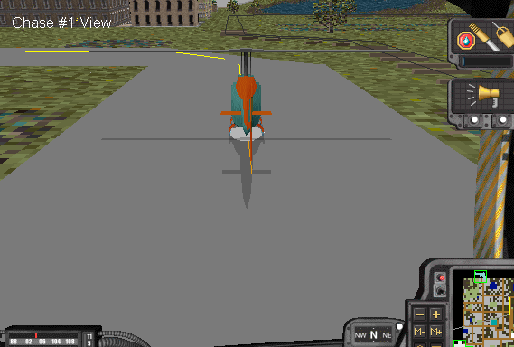
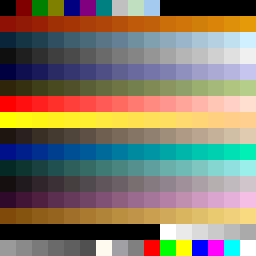
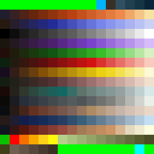

# Maxis Mesh Format

This document describes the format of the composite mesh files (`.max`) used by late-90s Maxis games [SimCopter](https://en.wikipedia.org/wiki/SimCopter) and [Streets of SimCity](https://en.wikipedia.org/wiki/Streets_of_SimCity).

## General Notes

* All integers are little-endian.
* The coordinate system used for meshes is as follows:
  * +Y is up.
  * Moving objects with a clear forward direction (cars, helicopters, etc.) usually point along the +Z axis.
  * The coordinate system is [left-handed](https://en.wikipedia.org/wiki/Right-hand_rule#Coordinates).
* In the file section tables below:
  * In the "Type" column, the value "Int" is used to refer to both unsigned and signed integers. Generally, values like colour components and indices are unsigned, while geometric values like coordinates are signed.
  * The "Length" column specifies length in bytes.

### Scale

SimCopter and Streets of SimCity aren't particularly consistent in their use of scale, but the fact that SimCopter's manual specifies the rotor diameter for each helicopter permits a rough estimate of scale to be made.

SimCopter's manual states that the JetRanger's main rotor diameter is 11.28 metres. In the screenshot below, the shadow from the JetRanger's rotor (which is projected directly downward on account of it being a mesh rather than a computed shadow) is 322 pixels wide, while the width of the road is 423 pixels at the same vertical position in the image. Accordingly, the rotor is roughly 76% the width of the road, giving a road width of about 14.8 metres.

Assuming some error in this "measurement", it seems to indicate that each tile in SimCity 2000 is around 15 metres square in SimCopter. Since each road mesh in SimCopter occupies an entire tile, the coordinates of its corner vertices can be used to compute an approximate scale conversion factor.

In raw mesh coordinates, road pieces in SimCopter have a side length of about 4,194,302 (although this varies a small amount from mesh to mesh), giving a conversion factor of (4,194,302 / 15) = 279,620 units per metre.

279,620 seems arbitrary but is relatively close to a power of two (218 = 262,144), and (4,194,302 / 262,144) = 16, so it's probable that SimCity 2000 tiles are actually considered to have a side length of 16 metres, not 15.

In practice, using a conversion factor of 262,144 units per metre yields good results when creating new meshes.

# File Format Overview

Maxis mesh files contain the following sections. Sections that may appear multiple times are marked with an asterisk; for example, an object typically contains many vertex definitions before its face definitions start, and each face definition typically lists a few vertex indices before UV coordinates are specified.

* File Signature
* Address of Colour Map
* Address of Geometry Table
* Colour Map
  * Colour *
* Geometry Table
  * Geometry Table Entry *
  * Duplicate Geometry Table Entry *
* Object *
  * Vertex *
  * Face *
    * Face Vertex Index *
    * Face UV Coordinates *

# File Sections

Note that multiple sections use the same name.

## File Signature (DIRC)

Quantity: 1

Offset | Type | Length | Description
---|---|---|---
0 | Char | 4 | File signature (DIRC)
4 | Int | 4 | File size
8 | Int | 4 | Unknown. Always 2. Likely the number of addresses to follow.

## Address of Colour Map (CMAP)

Quantity: 1

Offset | Type | Length | Description
---|---|---|---
12 | Char | 4 | CMAP
16 | Int | 4 | Address of colour map. Always 28 (0x1C).

## Address of Geometry Table (GEOM)

Quantity: 1

Offset | Type | Length | Description
---|---|---|---
20 | Char | 4 | GEOM
24 | Int | 4 | Address of geometry table. Always 829 (0x033D).

## Colour Map (CMAP)

Quantity: 1

Only the colour map in the first of the three `max` files is used by each game.

Within the colour map, each colour is three bytes in RGB order.

Offset | Type | Length | Description
---|---|---|---
28 | Char | 4 | CMAP (start of colour map section)
32 | Int | 4 | Total size of colour map section. Always 801 (0x0321). If additional colour maps were present, would presumably include their size as well (12 for header plus 789 for each colour map).
36 | Int | 4 | Unknown. Always 1. Likely the number of colour maps.
40 | Char | 4 | CMAP (start of individual colour map)
44 | Int? | 4 | Unknown. Possibly meant to be interpreted as two groups of two bytes or four individual bytes since treating it as a 32-bit integer (signed or unsigned) gives an apparently random value. Different for each of the three SimCopter `max` files, but the same for all three Streets of SimCity `max` files (`00 40 12 84`).
48 | Int? | 9 | Unknown. Being a multiple of three implies it may be a set of three special colours. Same value in all `max` files on a per-game basis: `00 00 80, 80 00 80, 00 80 80` for SimCopter, `22 D0 F0, 30 C7 C7, C7 76 C8` for Streets of SimCity.
57 | Int | 4 | Address of start of colour data. Always 61 (0x3D).

### Colour

Quantity: 256

Offsets are relative to start of section.

Offset | Type | Length | Description
---|---|---|---
0 | Int | 1 | Red value
1 | Int | 1 | Green value
2 | Int | 1 | Blue value

### Colour Map Images

Each game uses a single colour map that's repeated in each of its `max` files. Note the presence of 16-colour gradients within both colour maps: these are used for smooth-shaded faces (individual colours within them are also assigned to flat-shaded faces).

The first and last 10 colours of SimCopter's colour map are [the 20 colours of the Windows system palette](https://en.wikipedia.org/wiki/List_of_software_palettes#Microsoft_Windows_default_20-color_palette) (these colours and the indices that contain them are reserved). The same range is occupied by a single shade of green in Streets' colour map (apart from the second-last colour being cyan, oddly, which is consistent with the system palette). It appears that Streets skips these ranges when loading its colour map, leaving the system palette as-is rather than overwriting it with green: some flat-shaded faces on its models are assigned indices in the system palette range and those faces aren't green in-game.

SimCopter's colour map:

Streets of SimCity's colour map:

## Geometry Table (GEOM)

The geometry table contains information about each object within the composite mesh file. Only its first entry is used by the games (see notes [here](https://github.com/haffmans/Maxis-formats/tree/master/experiments#notes)).

Oddly, the geometry table is immediately followed by a duplicate table containing most of the same information. The contents of the duplicate table aren't used by either game.

Offset | Type | Length | Description
---|---|---|---
829 | Char | 4 | GEOM
833 | Int | 4 | Size of geometry table
837 | Int | 4 | Number of entries in the geometry table (NGTE)
841 | Int | 4 | Number of objects, which equals the number of entries in the duplicate geometry table (Nobjects = NGTE - 1)
845 | Int | 4 | Address of geometry table. Always 853.
849 | Int | 4 | Address of duplicate geometry table. Always 853 + 53*NGTE

### Geometry Table Entry

Quantity: NGTE

Each entry in the geometry table is 53 bytes in length.

The first entry in the geometry table contains totals (e.g., total number of vertices) summed across all objects in the file.

Offsets are relative to start of section.

Offset | Type | Length | Description
---|---|---|---
0 | Char | 17 | Name of object/mesh (null-terminated). If the name is shorter than 16 bytes, the bytes following the terminating null are arbitrary. The name of the first entry is the file name without its extension (e.g., `sim3d1`).
17 | Int | 4 | Address of object.
21 | Int | 4 | Number of objects. For the first entry in table, the number of objects in the file; otherwise 1.
25 | Int | 4 | Unknown. Always 0.
29 | Int | 4 | Number of "rendered" vertices. This counts shared vertices once for every face that uses them and doesn't include the "origin" vertex.
33 | Int | 4 | Unknown. Always 0.
37 | Int | 4 | Unknown. Always 0.
41 | Int | 4 | Number of faces.
45 | Int | 4 | Number of unique vertices, including the "origin" vertex. This is the number of vertices stored in the corresponding object.
49 | Int | 4 | Unknown. Always 0.

### Duplicate Geometry Table Entry

Quantity: Nobjects

Each entry in the duplicate geometry table is 36 bytes in length. The name field is replaced with an ID number and the object count is absent.

The duplicate geometry table lacks the initial summary entry present in the first geometry table.

Offset | Type | Length | Description
---|---|---|---
0 | Int | 4 | ID number.
4 | Int | 4 | Address of object.
8 | Int | 4 | Unknown. Always 0.
12 | Int | 4 | Number of "rendered" vertices. This counts shared vertices once for every face that uses them and doesn't include the "origin" vertex.
16 | Int | 4 | Unknown. Always 0.
20 | Int | 4 | Unknown. Always 0.
24 | Int | 4 | Number of faces.
28 | Int | 4 | Number of unique vertices, including the "origin" vertex. This is the number of vertices stored in the corresponding object.
32 | Int | 4 | Unknown. Always 0.

## Object (OBJX)

Quantity: Nobjects

Offsets are relative to start of section.

Offset | Type | Length | Description
---|---|---|---
0 | Char | 4 | OBJX
4 | Int | 4 | Size of object minus 12. Presumably the 12-byte deficit is a bug.
8 | Int | 2 | Number of vertices (Nvertices)
10 | Int | 2 | Number of faces (Nfaces)
12 | Int | 4 | Unknown. Always 0.
16 | Int | 1 | Unknown. For ground pieces (1x1, 2x2, NxN, etc.), roughly (N*64) % 256. 
17 | Int | 1 | Unknown. For ground pieces (1x1, 2x2, NxN, etc.), roughly (N*65) % 256. 
18 | Int | 1 | Unknown. Affects collision: if 0, no collision. For ground pieces (1x1, 2x2, NxN, etc.), roughly (N*45). Generally proportional to the size of the object. See [here](https://github.com/CahootsMalone/maxis-mesh-stuff/blob/master/Info/Collision%20notes.md) for further thoughts.
19 | Int | 1 | Unknown. Almost always zero. See notes linked above.
20 | Int | 4 | Unknown. Always 0.
24 | Char | 88 | Name of object (null-terminated). If the name is shorter than 87 bytes, the bytes following the terminating null are also null.
112 | ? | 12 | Unknown. Possibly a hash. If this value is changed, the game will crash with the error "ERROR: unable to get object [ID number]", where the ID number is the one from the duplicate geometry table.

### Vertex

Quantity: Nvertices

The first vertex in the list is never used for face definitions and appears to be an origin point (possibly from whatever 3D modeling software was used to create the meshes). Neither game seems to use it.

Offsets are relative to start of section.

Offset | Type | Length | Description
---|---|---|---
0 | Int | 4 | X coordinate
4 | Int | 4 | Y coordinate
8 | Int | 4 | Z coordinate

### Face

Quantity: Nfaces

Offsets are relative to start of section.

Offset | Type | Length | Description
---|---|---|---
0 | Char | 4 | FACE
4 | Int | 4 | Size
8 | Int | 2 | Number of face vertices (Nface vertices). 1 for points (e.g., flashing lights), 2 for lines (e.g., lane markings on roads in SimCopter), 3+ for polygons.
10 | Int | 2 | Seems to be a set of flags. See notes below.
12 | Int | 2 | Whether or not face is a light. 0 if not a light, 1 for point lights, 4 for polygon lights.
14 | Int | 4 | Unknown. For face type 18 (faces textured using a texture atlas), equals the face's zero-based index; for other face types, equals the colour/texture index.
18 | Int | 1 | Face type. See notes below.
19 | Int | 1 | Colour map index, texture index, or index within texture atlas.
20 | Int | 1 | If 0, face uses colour or dedicated texture. If non-zero, specifies index of texture containing texture atlas.

#### Face Vertex Index

Quantity: Nface vertices

Offsets are relative to start of section.

Offset | Type | Length | Description
---|---|---|---
0 | Int | 2 | Vertex index in object's vertex list

#### Face UV Coordinates

Quantity: Nface vertices

Offsets are relative to start of section.

Offset | Type | Length | Description
---|---|---|---
0 | Int | 4 | U coordinate. Divide by 65,536 to get value.
4 | Int | 4 | V coordinate. Divide by 65,536 to get value.

For faces textured using a dedicated texture (rather than one from a texture atlas), coordinates outside [0.0, 1.0] sometimes yield strange results: the face may be rendered using a dedicated texture adjacent to the one specified or random noise (perhaps out-of-range memory interpreted as a texture).

# Notes

## Unknown Four-Byte Sequences in Colour Map Header

As described above, the colour map header contains a four-byte section of unknown significance.

SimCopter values:
* `sim3d1.max`: 0, 123, 124, 131
* `sim3d2.max`: 0, 240, 69, 130
* `sim3d3.max`: 0, 192, 70, 130

If the last three bytes of these sequences are interpreted as colours, the resulting colours don't appear in the SimCopter colour map.

Streets of SimCity values:
* All `max` files: 0, 64, 18, 132

If the last three bytes of this sequence are interpreted as a colour, the resulting colour doesn't appear in the Streets of SimCity colour map.

## Special Colours in Colour Map Header

As described above, the colour map header contains a nine-byte section that appears to contain three colours that are presumably special in some way. For each game, these nine bytes are the same in all three `max` files.

In SimCopter, the colours are:
* (0, 0, 128): [Navy blue](https://en.wikipedia.org/wiki/Navy_blue). Appears in the colour map at index 4.
* (128, 0, 128): [Purple](https://en.wikipedia.org/wiki/Purple). Appears in the colour map at index 5.
* (0, 128, 128): [Teal](https://en.wikipedia.org/wiki/Teal). Appears in the colour map at index 6.

In Streets of SimCity, the colours are:
* (34, 208, 240): A sky-blue colour. Doesn't appear in the colour map.
* (48, 199, 199): A light greenish-blue. Doesn't appear in the colour map.
* (199, 118, 200): A light purple. Doesn't appear in the colour map.

## Texture Indices

* Texture indices point to textures within `sim3d.bmp`.
  * There is one exception: index 20 refers to the fifth texture (index 4) of `sky.bmp`, a texture atlas containing ground, water, and rubble textures. The texture at index 20 in `sim3d.bmp` is a 1 x 256 image filled with a single grey colour.
* For face type 2 (a line representing a sprite), the texture index is typically a tree texture.

## Colour Indices

* Untextured, flat-shaded faces use colours from the entire gradient within which their assigned colour appears, depending on orientation and time of day. If a face's colour doesn't appear within a gradient, the same shade is used regardless of external factors (for example, the body of the ambulance in SimCopter is assigned to a white colour that appears at the end of the colour map).
* In SimCopter, faces representing light (e.g., from car headlights or street lights) are assigned colour indices that don't match their appearance in-game. It appears their colour indices are remapped to a different part of the colour map.
* In Streets of SimCity, colour indices often don't match in-game colours. The difference between the index of the in-game colour (or a colour within the colour gradient) and the index specified in the mesh varies.

## Face Types

A single byte specifies the face type. It may be a set of flags, but that seems unlikely (for example, values of 13 and 18 both correspond to textured faces, but have none of the same bits set).

Values:
* 2: Line defining a quad representing a billboard sprite (e.g., a tree in a park)
  * Like regular lines, each is formed using two of the parent object's vertices. The first vertex is the midpoint of one side of the quad. The second vertex is the midpoint of the top edge of the quad. The midpoint of the bottom edge of the quad is the vertex that follows the line's first vertex in the object's list of vertices.
    * For example, a tree within an object might be defined by the line formed by vertices at indices A and B within the object's vertex list. The vertex giving the midpoint of the bottom edge of the tree's quad would be at index (A+1) in the object's vertex list.
  * Lines of this type (and the quads they define) are always parallel to the XY plane (i.e., the Z axis is perpendicular to them). In-game, the quad's texture is rendered as a billboard sprite (it always faces the camera).
* 11: Face that's translucent
* 13: Face that's textured using a dedicated texture. In SimCopter, only the bambi bucket contains faces of this type (they use a dedicated wood texture).
* 15: Face that's flat-shaded using a single colour from the colour map
  * Usually affected by time of day (darker at night), but not always.
  * It's unclear what determines whether or not a flat-shaded face is affected by time of day. It's not specified by the face's flags value. For example, most of the Apache helicopter's fuselage (face type 15 with a flags value of 3) is affected by time of day, but its tail rotor (also face type 15 with a flags value of 3) is not.
* 18: Face that's textured using a texture within a texture atlas
* 19: Face that's smooth-shaded using a range of colours from the gradient in which its assigned colour appears within the colour map.
  * Not affected by time of day.
* 20: Line
* 25: Point that represents a light
* 26: Point that represents a smoke emitter (these appear above the smokestacks of factories)

A few additional values appear only in Streets of SimCity's `max` files:
* 0 (two faces)
* 49 (one face)
* 158 (one face)
* 209 (one face)

## Face Flags

The following table lists all the face flag values that appear in SimCopter and Streets of SimCity. As noted, a few values appear in only one of the two games in a single face each.

Value | Binary | Associated Face Types | Notes
---|---|---|---
0       | 0000000000000000 | 0 | Appears once in Streets of SimCity
2       | 0000000000000010 | 11, 25, 26 | Translucent faces, point lights, and point smoke emitters
3       | 0000000000000011 | 15 | Flat-shaded faces only
22      | 0000000000010110 | 2 | Lines representing sprites only
101     | 0000000001100101 | 49 | Appears once in Streets of SimCity
2050    | 0000100000000010  | 15 | Flat-shaded faces only
8194    | 0010000000000010 | 13, 18 | Textured faces only
8214    | 0010000000010110 | 2 | Appears once in SimCopter
14043   | 0011011011011011 | 158 | Appears once in Streets of SimCity
16386   | 0100000000000010 | 19 | Smooth-shaded faces only
32770   | 1000000000000010 | 20 | Lines only
38912   | 1001100000000000 | 0 | Appears once in Streets of SimCity
65507   | 1111111111100011 | 209 | Appears once in Streets of SimCity

# References

* When I first became interested in reverse-engineering the Maxis mesh format, I encountered [this page](https://github.com/wyozi/Maxis-formats/blob/master/docs/simcopter-max-format.md) in a repo belonging to Wyozi. It was a great help and saved me the trouble of figuring out the basics of how geometry is represented in Maxis mesh files.
  * I recently learned that Wyozi's page is a copy of [this page](https://sourceforge.net/p/miscopter/wiki/MAXFormat/) written by Hornpipe2 with a few additions and formatting changes (the latter is cited by the former in the repository's [README](https://github.com/wyozi/Maxis-formats/blob/master/README.md), albeit indirectly). Hornpipe2 also wrote [this object extraction code](https://sourceforge.net/p/miscopter/code/HEAD/tree/trunk/tools/extract_obj.c), which I unfortunately encountered after having already written a basic mesh renderer and extractor (as well as the various other odds and ends to faciliate modding that are present in the repo containing this document). It did, however, save me some time by indicating that the different face type values are consistently assigned.
  * Hornpipe2 also wrote documents describing the Maxis composite bitmap format and the contents of the SimCopter CD; both are available [here](https://sourceforge.net/p/miscopter/wiki/Home/).
* Wyozi's repo linked above was forked by Haffmans, and I made a few updates to [the mesh documentation in this fork](https://github.com/haffmans/Maxis-formats/blob/master/docs/simcopter-max-format.md) a while ago before deciding to write new documentation in my own repo following the format I've used for my other reverse-engineering efforts. The present document contains information not present in any of the sources above and to the best of my knowledge is the most complete public documentation of the Maxis mesh format.
* Haffmans' fork also includes a number of modified mesh files I added while reverse-engineering the mesh format; they're documented [here](https://github.com/haffmans/Maxis-formats/tree/master/experiments).
* If you're reading this, you may already be aware of the mods I've created for SimCopter and Streets of SimCity. If not, they are available [here](https://github.com/CahootsMalone/maxis-mods). I'm rather fond of the one that replaces the burglar's car with the Oscar Mayer Wienermobile.
* If you're interested in modding, [my Python script to export objects from Blender in Maxis mesh format](https://github.com/CahootsMalone/maxis-mesh-stuff/tree/master/Python/Blender-export-script) may be useful. The binary file it generates can be used as input to [my `mesh-replace` tool](https://github.com/CahootsMalone/maxis-mesh-stuff/tree/master/Mesh-tools) for modding. Textures may be edited or added using [my Maxis Texture Tool program](https://github.com/CahootsMalone/maxis-texture-tool). 