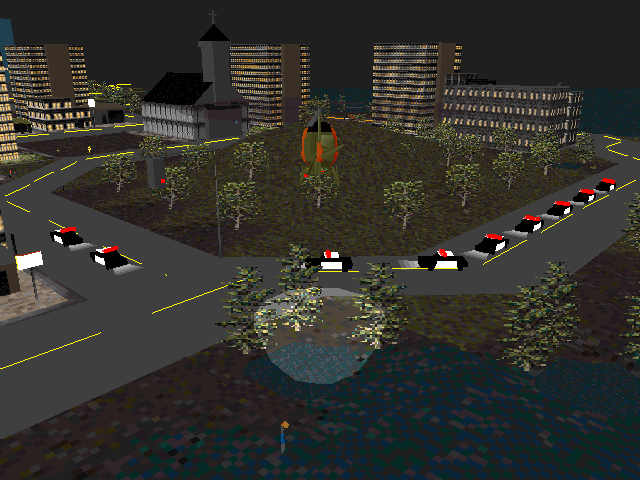

# Mesh Tools

For Maxis mesh files (`sim3d#.max`) of the format used for SimCopter and Streets of SimCity.

## Mesh Extract

Extracts and saves the mesh at the specified index from the specified Maxis mesh file.

### Usage

```
mesh-extract (--source <path> --index <integer> --output <path> | --help)
```

Example:
```
// Extract the police car mesh.
mesh-extract --source "C:/SimCopter CD/SIMCOPTER/geo/sim3d2.max" --index 97 --output "C:/Temp/police-car.bin"
```

## Mesh Replace

Replaces the mesh/meshes at the specified index/indices in a Maxis mesh file with the specified data.

### Usage

```
mesh-replace (--source <path> --index <integer> --replacement <path> --output <path> | --help)
```

When specifying multiple indices, use commas as delimiters (e.g., `--index 1,2,3`).

Example:
```
// Replace all the civilian vehicles with the police car.
// The file police-car.bin was extracted using the example mesh-extract command above.
mesh-replace --source "C:/SimCopter CD/SIMCOPTER/geo/sim3d2.max" --index 77,80,81,108,109,110 --replacement "C:/Temp/police-car.bin" --output "C:/Temp/sim3d2-simcopter-all-police.max"
```

