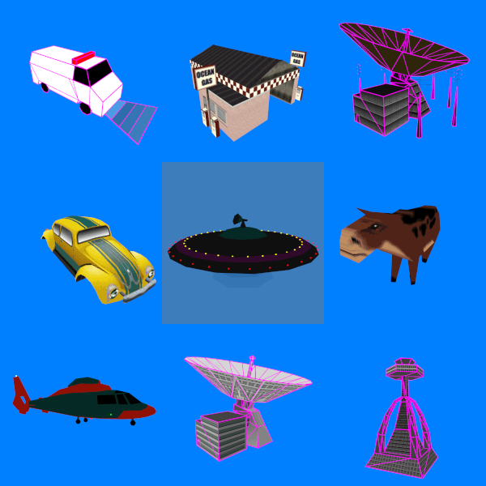

# Maxis Mesh Stuff

The 3D models used in late-90s Maxis games SimCopter and Streets of SimCity are stored in files with the extension `.max`. Each file contains many models.

This respository contains tools and information related to these files.

Repository contents:
* [C++](C++): Source code for the `mesh-extract` and `mesh-replace` command-line tools (executables are in the Mesh Tools folder; see below).
* [Info](Info): Information regarding the mesh format used by SimCopter and Streets of SimCity.
  * [Maxis Mesh Format Documentation](Info/Maxis-Mesh-Format.md): A description of the Maxis mesh format used for SimCopter and Streets of SimCity.
* [Mesh Tools](Mesh-tools): Command-line tools to extract meshes from and replace meshes within Maxis mesh files.
* [Processing](Processing): Scripts for use with [Processing](https://processing.org/), a Java-based graphics framework.
  * [Maxis Mesh Viewer](Processing\maxis_mesh_viewer): A tool for viewing 3D models from SimCopter and Streets of SimCity. It can also export meshes to [Wavefront OBJ format](https://en.wikipedia.org/wiki/Wavefront_.obj_file).
      
* [Python](Python): Python scripts to export models from Blender in Maxis mesh format and to tabulate details from Maxis mesh files.